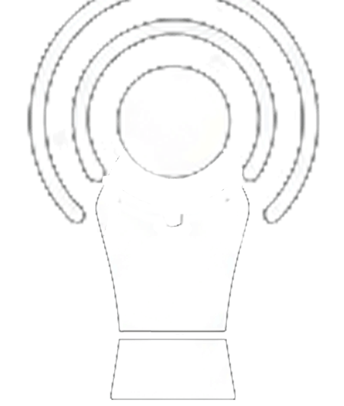

# Steno — AI Meeting Assistant

<div align="center">
  
  <h3>Ваш персональный секретарь для онлайн-встреч</h3>
  <br>

  [](https://github.com/sergeygalay/meetAssistant/releases/latest)
</div>

---

**Steno** — это современное и легковесное приложение для macOS, созданное для записи онлайн-встреч и их последующего анализа с помощью искусственного интеллекта (Google Gemini). Приложение не только сохраняет аудио и видео, но и автоматически генерирует структурированные протоколы встреч по вашим правилам, используя встроенную систему "Агентов".

## 💼 Ключевые возможности

*   **Двойная запись без драйверов:** Приложение использует нативные механизмы macOS (`ScreenCaptureKit`, `AVFoundation`) для одновременной записи экрана (со звуком собеседников) и отдельной дорожки вашего микрофона. Никаких сторонних расширений ядра или виртуальных кабелей.
*   **Встроенный мультимедиа-плеер:** Мощный кастомный плеер позволяет синхронно проигрывать записанное видео с системным звуком и аудиодорожку с микрофона. Прямо в приложении вы можете менять громкость каждой дорожки (микшер) или отключать их (Mute).
*   **Система Агентов (Промптов):** Создавайте разных ИИ-ассистентов ("Агентов") для любых типов встреч. Например: "Подробный протокол для Confluence", "Краткое саммари для Telegram", "Выделение только задач (Action Items)".
*   **Оконный интерфейс в стиле Apple Notes:** Интуитивно понятное управление записями и просмотр сгенерированных протоколов с рендерингом Markdown (таблицы, списки, форматирование текста) в светлой системной теме.
*   **Удобный Онбординг:** При первом запуске Steno проведет вас через простую настройку разрешений (Экран, Микрофон) и ввод API-ключа от Google Gemini.
*   **Фоновый режим и Нативный таймер:** Записывайте встречи и запускайте генерацию протоколов напрямую из строки меню (System Tray). При старте записи иконка превращается в нативный растягивающийся таймер времени записи, который идеально вписывается в интерфейс macOS.

## 🚀 Инструкция по использованию

### 1. Установка и Первая настройка
1. Скачайте актуальную `.dmg` сборку приложения по [этой ссылке](https://github.com/sergeygalay/meetAssistant/releases/latest).
2. Откройте образ и перетащите `Steno.app` в папку "Программы" (Applications).
3. Запустите приложение. Появится экран **Онбординга**, который поможет:
   * Дать разрешения на **Запись экрана** и доступ к **Микрофону**.
   * Ввести ваш API ключ от Google Gemini (получить можно в [Google AI Studio](https://aistudio.google.com/)).

### 2. Настройки (Settings)
1. Кликните по иконке **Шестеренки** в верхней панели или выберите "Settings..." в меню трея.
2. Во вкладке **Общие (General)**: 
   * Выберите желаемое качество видео (Low, Medium, High, Ultra).
   * Выберите модель Gemini (по умолчанию используется `gemini-3-flash-preview`).
   * Включите или отключите опцию **Отображать время записи** в строке меню.
   * (Опционально) Настройте Base URL, если используете прокси.
3. Во вкладке **Агенты (Agents)**: 
   * Добавляйте, удаляйте или редактируйте промпты, по которым ИИ будет писать для вас протоколы.

### 3. Запись встречи
1. Нажмите кнопку **Record** (красный круг) в главном окне приложения или в меню трея. Иконка в трее изменится на динамический таймер записи, растягивающийся по мере увеличения времени (например, " 00:01:25 ").
2. Проведите встречу (вас и ваших собеседников будет отлично слышно).
3. Нажмите **Stop** (квадрат) в приложении, либо нажмите на сам таймер в строке меню и выберите "Stop Recording". Записи (видео `.mp4` и микрофон `.m4a`) автоматически сохранятся в локальную папку (по умолчанию `~/Movies/ScreenRecordings`).

### 4. Генерация протокола и Плеер
1. В левой панели выберите нужную встречу (сессию).
2. На верхней панели выберите желаемого "Агента" (например, "Краткая выжимка").
3. Нажмите кнопку **Generate** (Молния) и дождитесь окончания обработки. Сгенерированный протокол откроется в новой вкладке.
4. Чтобы просмотреть запись, переключитесь на вкладку **"▶️ Плеер"**. Используйте ползунки микшера снизу, чтобы настроить баланс громкости между основным видео и микрофоном.

---

## 🛠 Техническая часть

Steno — это десктопное приложение, написанное на **Python 3**, использующее **PyQt6** для графического интерфейса и нативные фреймворки macOS (через `PyObjC`) для захвата медиаданных.

### Технологический стек

*   **Язык:** Python 3.9+ (Рекомендуется 3.13)
*   **GUI:** PyQt6, QtAwesome (векторные иконки)
*   **Медиа-движок:** `ffmpeg`, `sounddevice` и `numpy` (для синхронизации и микширования звука в плеере)
*   **Интеграция с macOS:** PyObjC (`AVFoundation`, `Quartz`, `ScreenCaptureKit`, `CoreMedia`, `AppKit` для нативной интеграции с Menu Bar)
*   **ИИ:** `google-genai` (Официальный SDK от Google)
*   **Рендеринг:** `markdown` (преобразование сгенерированных отчетов в HTML)

### Структура проекта

*   [`app.py`](app.py) — Точка входа в приложение, инициализация Tray и MainWindow.
*   [`recorder.py`](recorder.py) — Мост к Objective-C/AVFoundation и ScreenCaptureKit для нативной записи экрана и звука без драйверов.
*   [`setup.py`](setup.py) — Конфигурация для сборки приложения через `py2app`.
*   [`app/core/`](app/core/) — Бизнес-логика:
    *   [`config.py`](app/core/config.py) — Управление настройками, моделями и агентами (загрузка/сохранение `~/.steno/config.json`).
    *   [`data_manager.py`](app/core/data_manager.py) — Сканирование файловой системы и группировка записей в сессии.
    *   [`ai_worker.py`](app/core/ai_worker.py) — QThread-воркер для фоновой работы с Google GenAI API (загрузка файлов и генерация).
*   [`app/ui/`](app/ui/) — Интерфейс (PyQt6):
    *   [`ui_main.py`](app/ui/ui_main.py) — Главное окно (тулбар, сплиттер, список сессий, Markdown-браузер).
    *   [`ui_onboarding.py`](app/ui/ui_onboarding.py) — Экран первичной настройки и запроса доступов (Permissions).
    *   [`ui_player.py`](app/ui/ui_player.py) — Встроенный видео-аудио плеер с кастомным движком на базе `ffmpeg` и микшером.
    *   [`ui_settings.py`](app/ui/ui_settings.py) — Окно управления настройками и CRUD агентов.
*   [`bin/`](bin/) — Зависимые бинарники (например, скомпилированный под macOS `ffmpeg`).

### Развертывание и Сборка

Для сборки standalone-приложения (`.app`) используется библиотека `py2app`.

#### 1. Установка зависимостей
Создайте виртуальное окружение и установите зависимости:
```bash
pip install PyQt6 google-genai pyobjc certifi py2app qtawesome markdown qdarktheme sounddevice numpy
```

*(Обратите внимание: для работы плеера в папке `bin/` должен находиться исполняемый файл `ffmpeg`)*

#### 2. Сборка `.app` бандла
Выполните команду в корне проекта:
```bash
python3 setup.py py2app
```
Собранное приложение появится в директории `dist/Steno.app`.

*(Примечание: В процессе разработки вы можете использовать флаг `-A` (alias mode) для быстрой сборки симлинками: `python3 setup.py py2app -A`)*

#### 3. Создание установочного `.dmg` образа
Для создания удобного образа `.dmg` используется bash-скрипт `build_dmg.sh`. В системе должна быть установлена утилита `create-dmg` (устанавливается через Homebrew: `brew install create-dmg`).

```bash
./build_dmg.sh
```
Готовый образ появится в корне проекта.

---
*Сделано с ❤️ для продуктивных встреч.*
