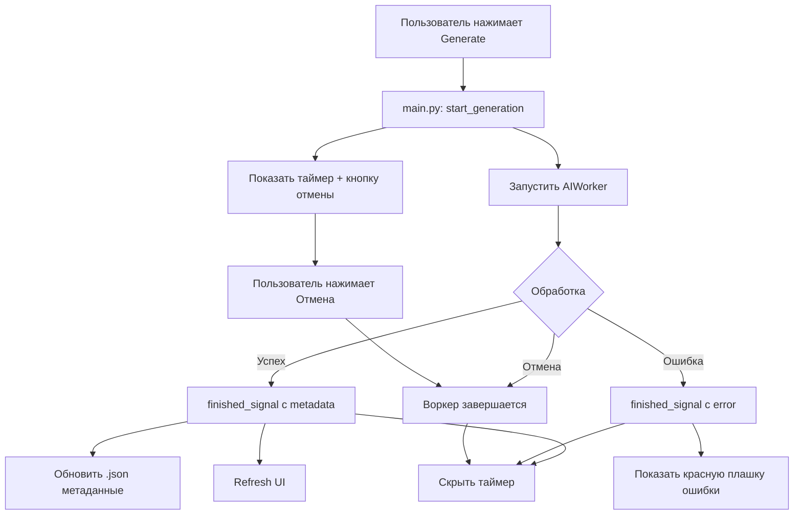

# План: Прогресс обработки, логирование и метаданные сессий

## Обзор текущего состояния

### Что есть сейчас:
- **AI обработка**: `AIWorker` (QThread) в `app/core/ai_worker.py` — имеет `cancel()` метод и `_cancel_event`, но **нет UI-кнопки отмены**
- **Индикатор**: кнопка Generate просто меняется на "Обработка..." и блокируется (`set_generating_state()` в `ui_main.py:440`)
- **Ошибки**: показываются только в системном уведомлении через tray (`tray_manager.show_message`)
- **Логи**: пишутся в `~/Library/Logs/Steno/app.log` — **нет ротации**, файл растёт бесконечно
- **Метаданные .json**: хранят только `{"name": "...", "created_at": "..."}` — нет информации о токенах, моделях, длительности
- **Токены**: считаются только глобально в `config.json` (`used_tokens`, `last_request_tokens`)

---

## Фича 1: Прогресс обработки, отмена и отображение ошибок

### 1.1 Таймер обработки в тулбаре

**Файлы**: `app/ui/ui_main.py`, `main.py`

В тулбаре рядом с кнопкой Generate добавляем:
- **QLabel для таймера** (`processing_timer_label`) — показывает прошедшее время "AI: 00:00"
- **QPushButton для отмены** (`cancel_btn`) — иконка ✕, вызывает отмену воркера
- При начале обработки: показываем таймер + кнопку отмены, запускаем QTimer (1 сек)
- При окончании: скрываем таймер + кнопку, останавливаем QTimer

```
Тулбар: [Record] ... [Tokens: ...] ... [Agent ▼] [AI: 01:23 ✕] [Generate] [⚙]
```

**Изменения в `ui_main.py`**:
- В `setup_toolbar()`: добавить `self.processing_timer_label` (QLabel) и `self.cancel_processing_btn` (QPushButton), изначально скрытые
- Добавить `self.processing_elapsed_timer` (QTimer) и `self.processing_start_time`
- Метод `set_generating_state(is_generating)`: показывать/скрывать таймер и кнопку отмены
- Новый метод `update_processing_timer()`: обновлять текст таймера
- Новый сигнал `cancel_generation_signal = pyqtSignal()`

**Изменения в `main.py`**:
- Подключить `cancel_generation_signal` к `self.worker.cancel()`
- В `start_generation()`: передать `processing_start_time`
- В `on_processing_finished()`: остановить таймер

### 1.2 Отображение ошибок в UI (красная плашка)

**Файлы**: `app/ui/ui_main.py`

Добавляем **баннер ошибки** между тулбаром и сплиттером:
- `QFrame` с красным фоном, текстом ошибки и кнопкой закрытия ✕
- Изначально скрыт (`hide()`)
- Показывается при ошибке обработки, исчезает по нажатию ✕ или через 15 секунд
- Стилизация: красный фон `#fef2f2`, красный бордер `#fca5a5`, текст `#991b1b`

```
┌─────────────────────────────────────────────────┐
│ ⚠ AI Ошибка: Rate limit exceeded...       [✕]  │
└─────────────────────────────────────────────────┘
```

**Изменения в `ui_main.py`**:
- В `setup_ui()`: создать `self.error_banner` (QFrame), `self.error_label` (QLabel), кнопку закрытия
- Вставить в `wrapper_layout` между `toolbar_widget` и `splitter`
- Новый метод `show_error_banner(message)`: показать плашку с текстом
- Новый метод `hide_error_banner()`: скрыть плашку
- QTimer на 15 секунд для автоскрытия

**Изменения в `main.py`**:
- В `on_processing_finished()`: при `success=False` вызывать `self.main_window.show_error_banner(message)`

### 1.3 Кнопка отмены обработки

**Файлы**: `app/ui/ui_main.py`, `main.py`

- Кнопка ✕ рядом с таймером
- Подключена к новому сигналу `cancel_generation_signal`
- В `main.py`: при отмене вызывается `self.worker.cancel()`, воркер завершается, UI возвращается в idle

---

## Фича 2: Логирование рядом с конфигом + ротация

### 2.1 Перенос логов

**Файлы**: `main.py`, `app/core/config.py`

- Путь логов: `~/.steno/steno.log` (рядом с `config.json`)
- Добавить константу `LOG_FILE` в `config.py`: `LOG_FILE = os.path.join(CONFIG_DIR, "steno.log")`
- В `main.py`: использовать новый путь

### 2.2 Ротация логов

**Файлы**: `main.py`

Использовать `logging.handlers.RotatingFileHandler` вместо `FileHandler`:
- **maxBytes**: 5 MB (5 * 1024 * 1024)
- **backupCount**: 2 (хранить steno.log, steno.log.1, steno.log.2 — итого до 15 MB)
- При превышении размера файл автоматически ротируется

```python
from logging.handlers import RotatingFileHandler

handlers = [
    logging.StreamHandler(sys.stdout),
    RotatingFileHandler(
        LOG_FILE,
        maxBytes=5 * 1024 * 1024,  # 5 MB
        backupCount=2,
        encoding='utf-8'
    )
]
```

---

## Фича 3: Расширение метаданных .json сессии

### 3.1 Новая структура .json

**Файлы**: `app/core/data_manager.py`, `app/core/ai_worker.py`, `main.py`

Текущая структура:
```json
{
    "name": "24.06.2024 15:30:00",
    "created_at": "24.06.2024_15:30:00"
}
```

Новая структура:
```json
{
    "name": "24.06.2024 15:30:00",
    "created_at": "24.06.2024_15:30:00",
    "recording": {
        "duration_seconds": 3600,
        "video_quality": "Medium",
        "video_path": "Meet_24.06.2024_15:30:00.mp4",
        "mic_audio_path": "Meet_24.06.2024_15:30:00_mic.m4a",
        "video_size_mb": 245.3,
        "mic_size_mb": 12.1
    },
    "reports": [
        {
            "agent_id": "default",
            "agent_name": "Стандартный протокол",
            "model": "gemini-3-flash-preview",
            "created_at": "2024-06-24T16:45:00",
            "processing_duration_seconds": 83,
            "tokens": {
                "input": 125000,
                "output": 3200,
                "total": 128200
            },
            "output_path": "Meet_24.06.2024_15:30:00_protocol_default.txt",
            "status": "success"
        }
    ]
}
```

### 3.2 Сохранение данных записи

**Файлы**: `main.py`

В `stop_recording()` — после остановки записи обновить JSON:
- Считать длительность из `self.recording_time`
- Записать `video_quality`, пути к файлам, размеры файлов

### 3.3 Сохранение данных обработки AI

**Файлы**: `app/core/ai_worker.py`

Расширить `finished_signal`:
```python
# Добавить данные для метаданных
finished_signal = pyqtSignal(bool, str, str, str, str, dict)
#                            success, title, message, base_name, agent_id, metadata_dict
```

Где `metadata_dict`:
```python
{
    "processing_duration_seconds": 83,
    "tokens_input": 125000,
    "tokens_output": 3200,
    "tokens_total": 128200,
    "model": "gemini-3-flash-preview",
    "agent_name": "Стандартный протокол",
    "output_path": "Meet_..._protocol_default.txt",
    "status": "success"  # или "error", "cancelled"
}
```

**Файлы**: `main.py`

В `on_processing_finished()`: записать `metadata_dict` в .json файл сессии.

### 3.4 Загрузка метаданных в MeetingSession

**Файлы**: `app/core/data_manager.py`

В `MeetingSession._load_metadata()`:
- Загружать `recording` и `reports` из JSON
- Хранить как атрибуты объекта: `self.recording_info`, `self.reports_info`

### 3.5 Вкладка "Инфо" в UI

**Файлы**: `app/ui/ui_main.py`

При выборе сессии (`on_session_selected`), добавить вкладку "ℹ️ Инфо":
- Показывать информацию о записи: длительность, качество, размеры файлов
- Для каждого отчёта: модель, агент, токены (input/output/total), время обработки, статус
- Стилизация: таблица или карточки в macOS-стиле

---

## Диаграмма потока данных



## Порядок реализации

1. **Логирование** (config.py + main.py) — минимальные изменения, можно сделать первым
2. **Таймер + отмена** (ui_main.py + main.py) — UI изменения в тулбаре
3. **Баннер ошибок** (ui_main.py + main.py) — UI дополнение
4. **Расширение AIWorker сигнала** (ai_worker.py) — добавить метаданные в сигнал
5. **Обновление .json при записи** (main.py) — сохранять recording info
6. **Обновление .json при обработке** (main.py + data_manager.py) — сохранять report info
7. **Вкладка Инфо** (ui_main.py + data_manager.py) — отображение метаданных

## Затронутые файлы

| Файл | Изменения |
|------|-----------|
| `app/core/config.py` | Добавить LOG_FILE константу |
| `main.py` | Логирование, таймер, баннер ошибок, метаданные записи/обработки |
| `app/ui/ui_main.py` | Таймер в тулбаре, кнопка отмены, баннер ошибок, вкладка Инфо |
| `app/core/ai_worker.py` | Расширить finished_signal, собирать метаданные |
| `app/core/data_manager.py` | Загружать расширенные метаданные из JSON |
